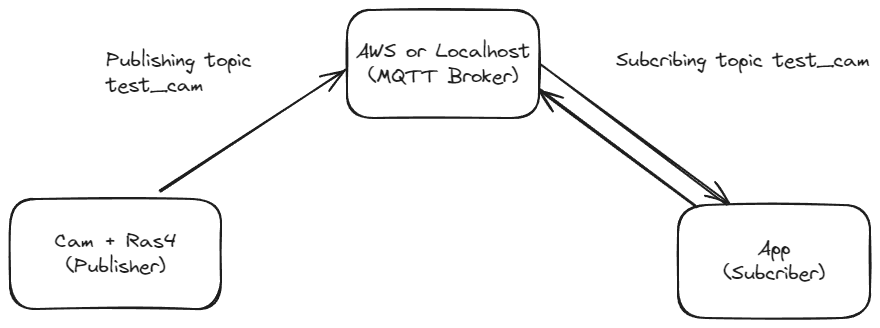

# ESP32 CAM - MQTT 

## Architecture



## How to run 
Localhost test:
- If you haven't already, you need to install **Mosquitto** on your system
- Install requirements
```bash
pip install -r requirements.txt
```
- Subscribe to the "test/cam" topic: In a new terminal window or Command Prompt, you will use the mosquitto_sub command to subscribe to the test/cam topic
``` bash
mosquitto_sub -h localhost -t test/cam
```
- Then run pub.py and sub.py

## TODO
- [ ] AWS Broker
- [ ] Config for ESP32
